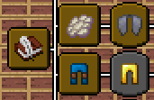

# Better Advancement Info (Advancement info Continued)


A Fabric mod that enhances the advancements screen with detailed information panels and customizable layouts.


## Features

- **Detailed Info Panel**: View advancement criteria and progress details in a side panel
- **Search Functionality**: Quickly find advancements by name or description
- **Customizable Layout**: Adjust margins and info panel width to your preference
- **Custom Colors**: Configure colors for completed and incomplete criteria
- **Fullscreen Support**: Adapts to any screen size

## Installation

1. Install [Fabric Loader](https://fabricmc.net/use/) for Minecraft 1.21.11
2. Download [Fabric API](https://modrinth.com/mod/fabric-api) (required)
3. Download [Cloth Config API](https://modrinth.com/mod/cloth-config) (required for configuration)
4. Place the mod JAR in your `mods` folder
5. Launch Minecraft!

## Requirements

- **Minecraft**: 1.21.11 or later
- **Fabric Loader**: 0.18.4+
- **Fabric API**: 0.140.2+1.21.11 or later
- **Cloth Config**: 21.11.153+ (optional but recommended for configuration)
- **Java**: 21+

## Configuration

Access the configuration through Mod Menu (if installed) or edit the config file directly at `.minecraft/config/advancementinfo.json`.

### Available Options:
- **Info Panel Width**: Min/max width and percentage of screen
- **Margins**: X and Y margins for the advancement screen
- **Colors**: Customize colors for completed/incomplete criteria

## Usage

1. **Open Advancements**: Press `L` (default keybind)
2. **View Details**: Hover over an advancement to see criteria in the info panel
3. **Click for More**: Click an advancement to pin its details
4. **Search**: Use the search box at the top of the info panel
5. **Scroll**: Use mouse wheel to scroll through long criteria lists
6. **Drag**: Click and drag the advancement tree to navigate

## Credits

### Original Author
**gbl** - Created the original AdvancementInfo mod for Minecraft 1.20.x and earlier
- Original Repository: https://github.com/gbl/AdvancementInfo
- Thank you for creating this amazing mod and making it open source!

### 1.21.11+ Port
**ultimategamermc** - Updated and maintained the mod for Minecraft 1.21.11+
- Fixed compatibility issues with new Minecraft rendering system
- Updated mixins for DrawContext API changes
- Resolved advancement tree panning/scrolling issues

### Special Thanks
- **Claude (Anthropic)** - AI assistant that helped debug complex mixin issues
- **Fabric Team** - For the excellent modding framework
- **Minecraft Modding Community** - For continued support and resources

## Known Issues

- The mod is in active development for 1.21.11+
- Some features from older versions may be temporarily unavailable
- Report issues on the [GitHub Issues](https://github.com/rajeshjaga/Advancement-Info/isssues) page

## License

This project maintains the original license from gbl's AdvancementInfo.
Please refer to the LICENSE file for full details.

## Building from Source

```bash
git clone https://github.com/rajeshjaga/Advancement-Info
cd Advancement-Info
./gradlew build
```

The built JAR will be in `build/libs/`

## Support

- **Issues**: [GitHub Issues](https://github.com/rajeshjaga/Advancement-Info/issues)
- **Discussions**: [GitHub Discussions](https://github.com/rajeshjaga/Advancement-Info/discussions)
- **Original Mod**: [gbl's AdvancementInfo](https://github.com/gbl/AdvancementInfo)

## Changelog

### Version 1.0.0 (1.21.11)
- Initial port to Minecraft 1.21.11
- Updated mixins for DrawContext API
- Fixed advancement tree panning and scrolling
- Updated dependencies to latest versions
- Improved fullscreen and custom resolution support

---

**Made with ❤️ for the Minecraft modding community**

*This is an unofficial continuation/port. All credit for the original concept and implementation goes to gbl.*
